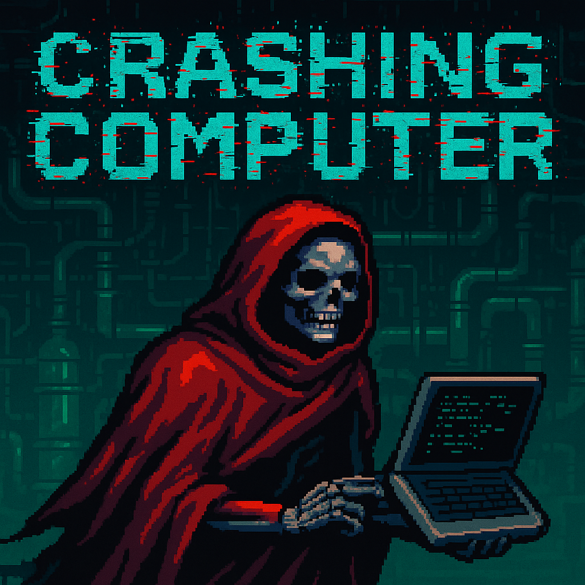
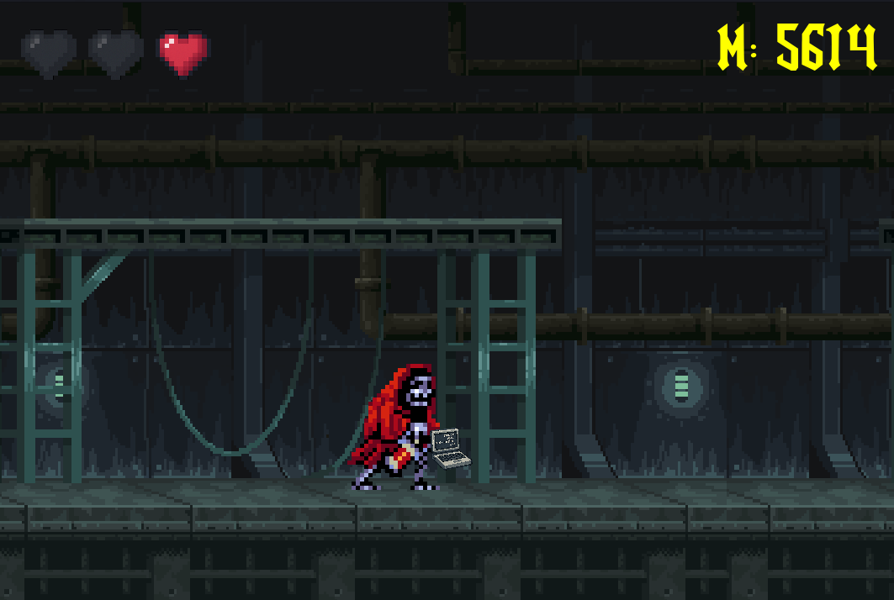
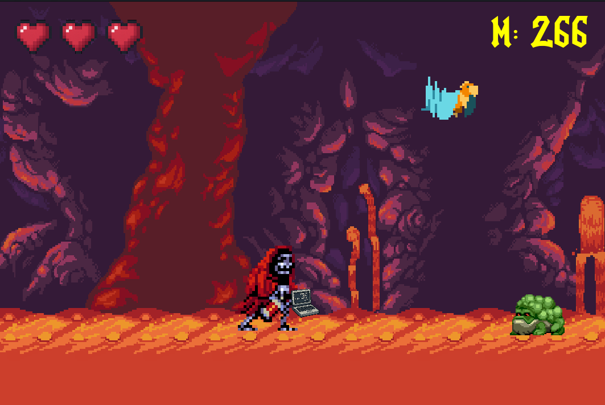
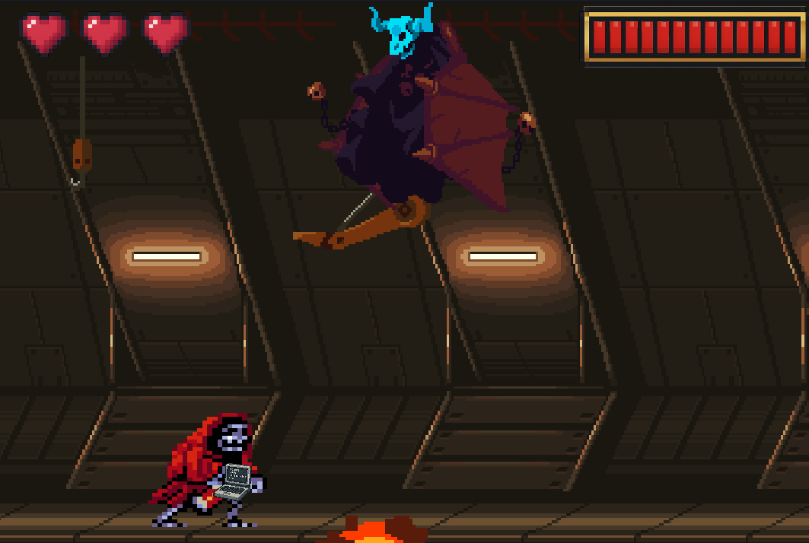
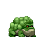
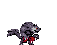
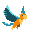
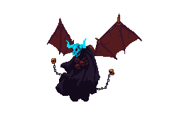

  <h1>Crashing Computer</h1>

<h2>Jogo desenvolvido na matéria de Programação II (Game developed in the Programming II course)</h2>

<h2>Antonio da Ressurreição Filho, student in the third semester of Computer Science at the Federal University of Paraná (UFPR).</h2>

## Professor: [Dr. Diego Addan.](https://www.inf.ufpr.br/diego)

  

# Português:

O projeto consiste no trabalho final da disciplina de Programação 2, em que foi pedido pelo docente da matéria um jogo no estilo Run ’n Gun. O programa
foi feito inteiramente na linguagem C, utilizando uma biblioteca específica de programação de jogos chamada [Allegro](https://liballeg-org.translate.goog/?_x_tr_sl=en&_x_tr_tl=pt&_x_tr_hl=pt&_x_tr_pto=tc).

***Importante:*** Para conseguir compilar o programa, deve-se instalar essa biblioteca na máquina do usuário, a fim de se ter uma interface gráfica.

<h3>Controles:</h3>

- **Pular:** Up Arrow.
- **Abaixar:** Down Arrow.
- **Caminhar para direita:** Right Arrow.
- **Caminhar para esquerda:** Left Arrow.
- **Atirar horizontalmente:** Space.
- **Atirar verticalmente:** Space + "W".

<h3>O jogo consiste em 3 fases:</h3>

- A **primeira fase** é construída com 10 inimigos.
- A **segunda fase** é contruída com 14 inimigos.
- A **terceira fase** é do Boss, em que não é usado rolling background
e o objetivo principal do usuário é matar o Boss para enfim ganhar o jogo.

<h3>Existem 4 tipos de inimigos:</h3>

- O primeiro consiste em um tipo de lesma que anda no sentido contrário ao que o personagem anda e seu objetivo é encostar nele para tirar 1 vida.
- O segundo consiste em um lobo que fica estático no lugar onde é colocado e atira hits na horizonta que só podem ser desviados com o personagem abaixando (apertando a tecla "down").
- O terceiro consiste em um pássaro que fica estático no lugar onde é colocado e atira hits na vertical. Caso o personagem esteja exatamente embaixo do pássaro, tem a chance de ele perder 1 vida.
- O quarto e último inimigo consiste no Boss, o qual tem 13 vidas, se mexe e atira um hit na vertical a cada poucos segundo e que pode tirar 1 vida do personagem caso acerte.

# English:

The project consists of the final assignment for the Programming 2 course, in which the instructor requested a Run ’n Gun style game.
The program was developed entirely in the C language, using a specific game programming library called Allegro.

Important: In order to compile the program, this library must be installed on the user's machine to enable a graphical interface.

<h3>Controls:</h3>

- Jump: Up Arrow.
- Crouch: Down Arrow.
- Walk right: Right Arrow.
- Walk left: Left Arrow.
- Shoot horizontally: Space.
- Shoot vertically: Space + "W".

<h3>The game consists of 3 stages:</h3>

- The first stage is built with 10 enemies.
- The second stage is built with 14 enemies.
- The third stage is the Boss stage, where a rolling background is not used and the user's main objective is to kill the Boss in order to win the game.

<h3>There are 4 types of enemies:</h3>

- The first is a type of slug that moves in the opposite direction of the character and its goal is to touch the character to take away 1 life.
- The second is a wolf that remains static in the place it is placed and shoots horizontal hits that can only be dodged by crouching (pressing the "down" key).
- The third is a bird that remains static in the place it is placed and shoots vertical hits. If the character is exactly below the bird, there is a chance of losing 1 life.
- The fourth and final enemy is the Boss, which has 13 lives, moves around, and shoots a vertical hit every few seconds. If the character is hit, they lose 1 life.

## Fases(Levels):

***Primeira fase(Level 1):***

  

***Segunda fase(Level 2):***

  

***Terceira fase(Level 3):***

  

## Inimigos(Enemies):

***Inimigo Lesma(Enemy slug):***

  

***Inimigo Lobo(Enemy Wolf):***

  

***Inimigo Pássaro(Enemy bird):***

  

***Inimigo The Boss(Enemy Boss):***

  

